# assignment1-recursion
Nazerke Bozgulan, SE-2514

Part 1:
Task 1. Print Digits of a Number
Write a recursive function that takes an integer as input and
prints every digit of the given number on a separate line.
Example:
Input: 5481
Output:
5
4
8
1
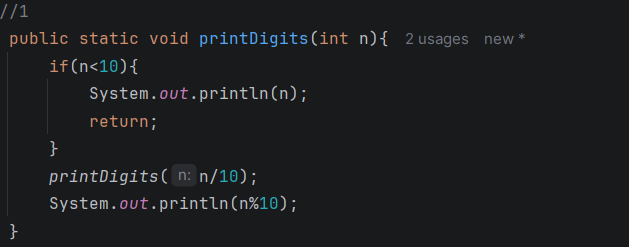 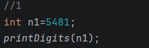 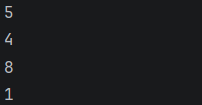

Task 2. Average of Elements
Write a recursive function to calculate the sum of the
elements, then compute the average using the result.
Example:
Input
4
3 2 4 1
Output
2.5 
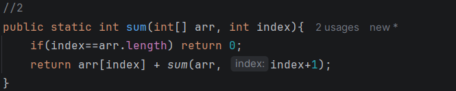 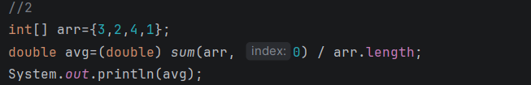 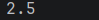

Task 3. Prime Number Check
Write a recursive function that checks whether a number n is
prime. A prime number is a number that is divisible only by 1 and
itself.
Example:
Input
7
Output
10
Prime
Composite 
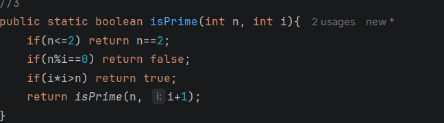 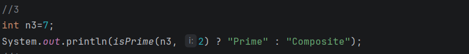 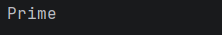

Task 4. Factorial
Write a recursive function that calculates n! (factorial).
Example:
Input
5
Output
120 
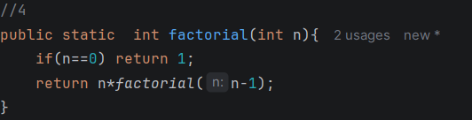 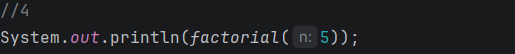 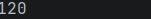

Part 2: Task 5. Fibonacci Number
Write a recursive function to find the n-th Fibonacci number.
Formula:

Base cases:
�
�𝑛	=	𝐹𝑛−1	+	𝐹𝑛−2

�
�0	=	0,	𝐹1	=	1

Example:

Input Output
5 5
17 1597
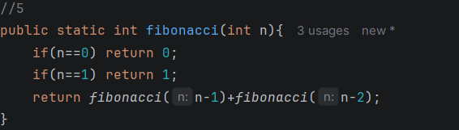 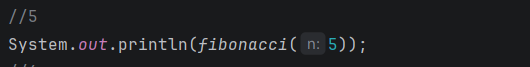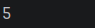

Task 6. Power Function

You are given numbers a and n. Write a recursive function that
returns:
�
�𝑛

Example
Input Output
2 10 1024
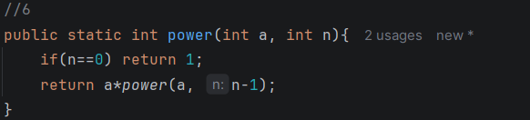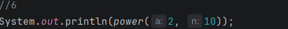 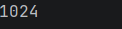

Task 7. Reverse Output

You are given n numbers. Write a recursive function that reads
and prints the numbers in reverse order without using another
array.

Example
Input Output
4
1 4 6 2
2 6 4 1
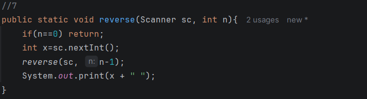 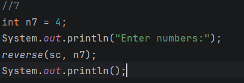 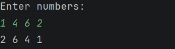

Part 3: Task 8. Check Digits in String

You are given a string s. Write a recursive function that
checks whether the string contains only digits. Return "Yes" if
all characters are digits, otherwise return "No".

Example:
Input Output
123456 Yes
123a12 No
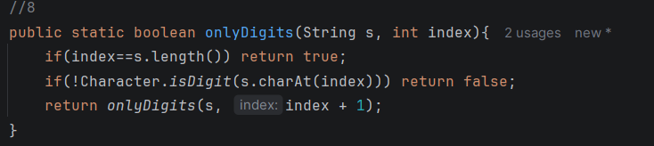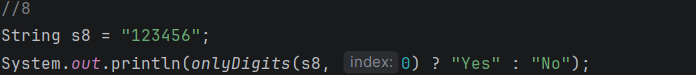 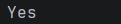

Task 9. Count Characters in a String

Write a recursive function that counts the number of characters in a
given string. The function should return the total number of characters
in the string.

Example:
Input Output
hello 5
recursion 9
 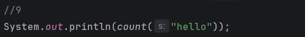 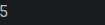

Task 10. Greatest Common Divisor (GCD)

Write a recursive function that finds the GCD of two numbers
using the Euclidean Algorithm.

Example:
Input Output
32 48 16
10 7 1 
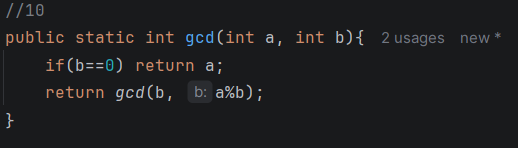 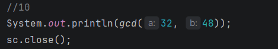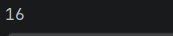
