# assignment2- Physical & Logical Data
Structures (Banking System)
Nazerke Bozgulan, SE-2514

Task 1. Bank Account Storage Using LinkedList
Create a class BankAccount containing:
• accountNumber
• username
• balance
Create a LinkedList to store accounts.
Program must allow user to:
• Add a new account
• Display all accounts
• Search account by username
Example Output:
Account added successfully
Accounts List:
1. Ali – Balance: 150000
2. Sara – Balance: 220000 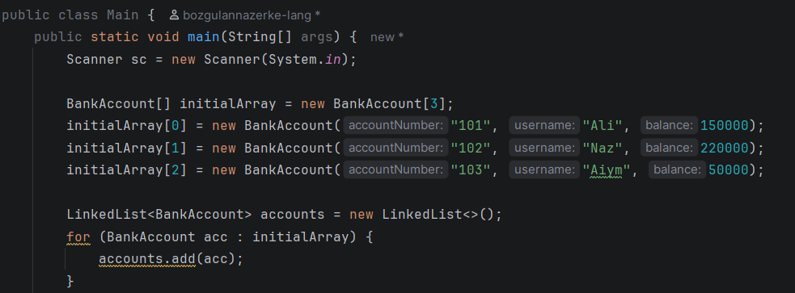 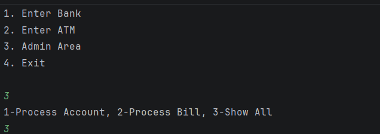 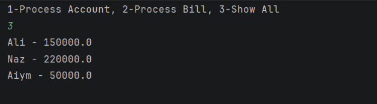
   Task 2 – Deposit & Withdraw Operations
   Extend Task 1 program to allow:
   • Deposit money
   • Withdraw money
   • Update balance inside LinkedList
   Example Output:
   Enter username: Ali
   Deposit: 50000
   New balance: 200000 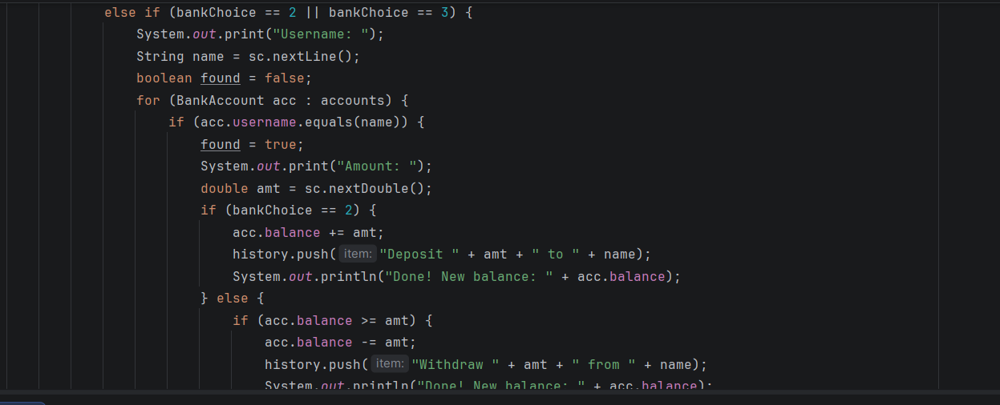 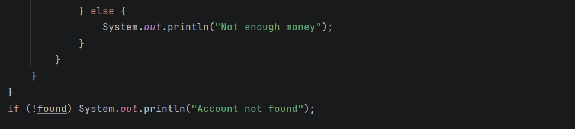
   Task 3 – Transaction History (Stack – LIFO)
   Create a Stack<String> transaction History
   Store actions:
   • Deposit  
   • Withdraw  
   • Bill payment  
   Program must allow:
   • Add transaction to stack  
   • Undo last transaction (pop)  
   • Display last transaction (peek)
   Example Output:
   Deposit 50000 to Ali
   Withdraw 20000 from Ali
   Last transaction: Withdraw 20000
   from Ali
   Undo → Withdraw removed 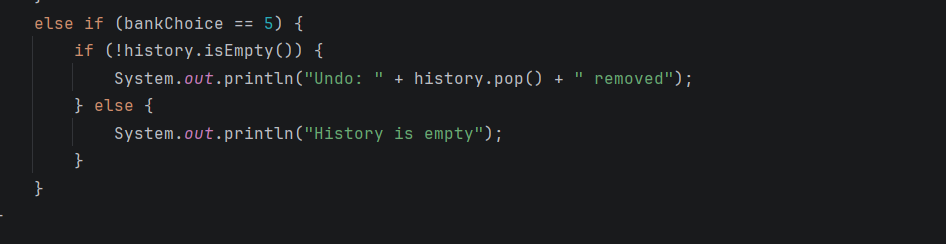 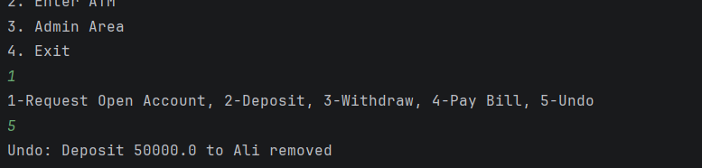
   Task 4 – Bill Payment Queue (Queue – FIFO)
   Create a Queue billQueue using LinkedList.
   Allow user to:
   • Add bill payment request
   • Process next bill payment
   • Display queue
   Example Output:
   Added: Electricity Bill
   Added: Internet Bill
   Processing: Electricity Bill
   Remaining: Internet Bill 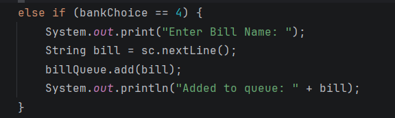 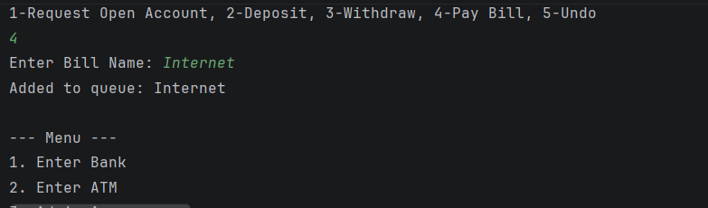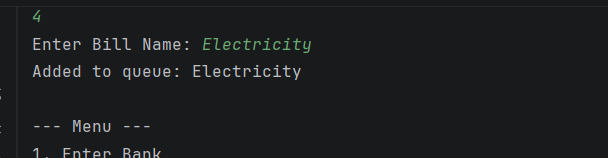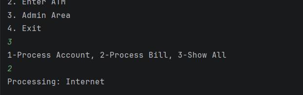
   Task 5 – Account Opening Queue (Admin Simulation)
   Create Queue accountRequests.
   User submits request → Admin processes queue.
   Program must:
   • Add account request to queue
   • Process request (move to main LinkedList)
   • Display pending requests
   This simulates real banking workflow. 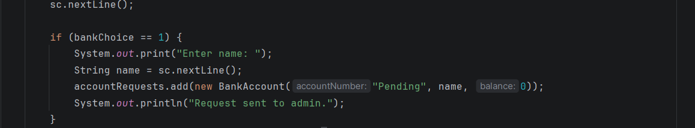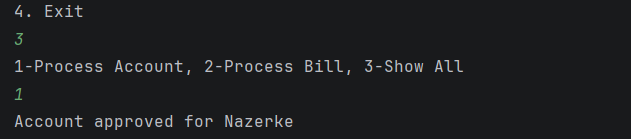
   Task 6. Create program that:
   • Creates array BankAccount[3]  
   • Stores 3 predefined accounts  
   • Prints them   
   1 – Enter Bank
   2 – Enter ATM
   3 – Admin Area
   4 – Exit
   Bank Menu
   User can:
   • Submit account opening request → goes to queue
   • Deposit money
   • Withdraw money
   Uses:
   • LinkedList accounts
   • Stack history
   ATM Menu
   • Balance enquiry
   • Withdraw
   Admin Menu
   • View and process account queue
   • View bill payment queue 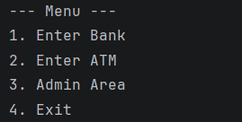 

